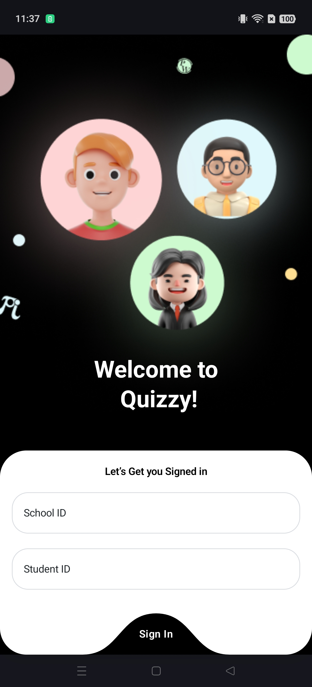
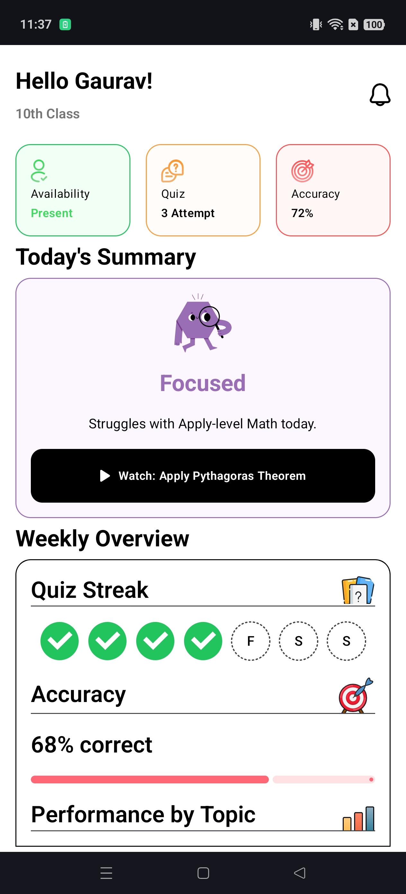
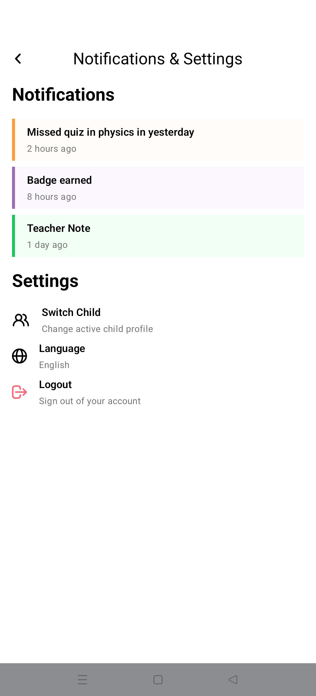

# Quizzy

Android application built as part of an **Android Developer Assignment**.

## Features
- Login → Home → Logout flow
- Firebase Authentication
- Home screen renders data from Mock API
- UI implemented as per Figma designs

## Tech Stack
- Kotlin
- Jetpack Compose
- MVVM Architecture
- Retrofit
- Coroutines & Flow
- Firebase Authentication
- Koin (DI)

## Setup
1. Clone the repository
2. Open in Android Studio
3. Add `google-services.json`
4. Enable Email/Password Auth in Firebase
5. Run the app

## Design
Figma: https://www.figma.com/design/D3oikbeJno5ewk28AaAuA7/Quizzy

## Author
Umang

## Screenshots

### Login Screen

### Home Screen

### Logout Flow

### APK
[APK](apk/app-debug.apk)
